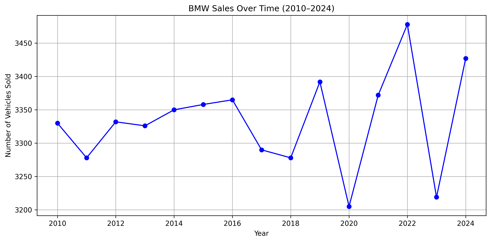
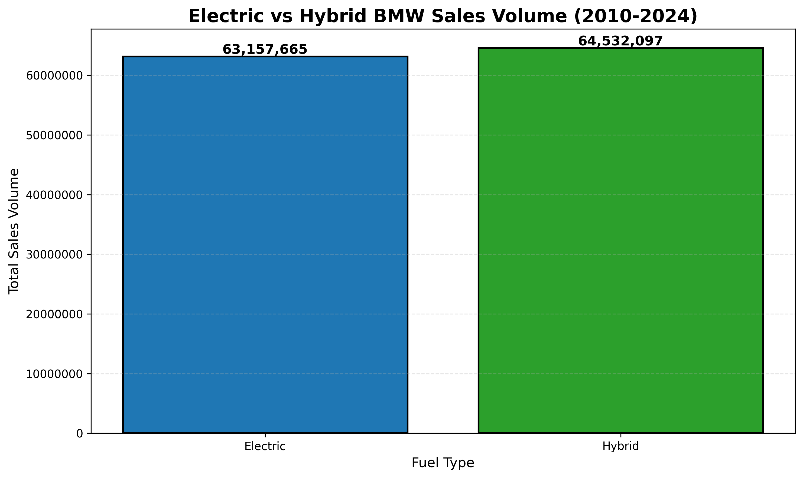
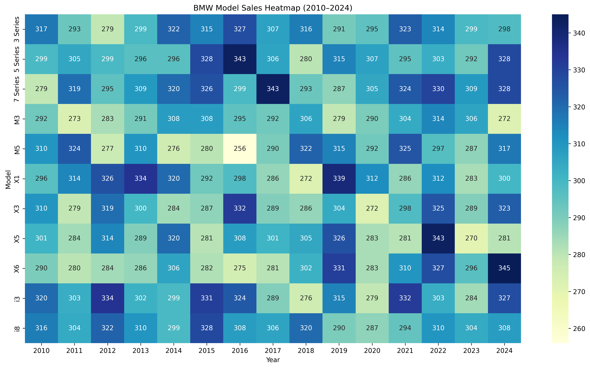

# 🚗 BMW Sales Data Analysis (2010-2024)

## 📊 Project Overview
Analyzed 50,000 BMW sales records across 14 years to identify sales trends, regional preferences, and fuel type adoption patterns. This analysis provides actionable insights into market segmentation and the evolving automotive landscape during the electric vehicle transition.

## 🎯 Key Insights

- **Regional preferences drive model popularity:** The i8 dominated European and South American markets, while the 7 Series led in North America and the Middle East, highlighting the importance of regional market strategies
- **Hybrid vehicles outperformed electric:** Despite the industry push toward EVs, hybrid vehicles achieved 2% higher cumulative sales (64.5M vs 63.2M units) over the 14-year period
- **Remarkable price stability:** Average BMW prices remained consistently around $75,000 USD throughout 2010-2024, showing resilience despite economic fluctuations
- **Diverse portfolio strength:** Top-selling models changed year-over-year (i3, M5, 5 Series, X1, X6), demonstrating BMW's success across multiple vehicle segments

## 🛠️ Tools & Technologies
- **Python:** pandas, numpy, matplotlib, seaborn
- **Google Colab / VS Code**
- **Analysis Methods:** Time series analysis, correlation analysis, market segmentation

## 📁 Dataset
- **Source:** BMW Sales Dataset (2010-2024)
- **Size:** 50,000 records, 11 columns
- **Features:** Model, Year, Region, Color, Fuel Type, Transmission, Engine Size, Mileage, Price, Sales Volume, Sales Classification
- **Data Quality:** No missing values or duplicates

## 📈 Key Visualizations

### BMW Sales Over Time (2010-2024)

*Sales showed significant year-over-year variability with peaks and dips throughout the period, indicating fluctuating market conditions and consumer demand.*

### Top-Selling BMW Models by Region

*Clear regional preferences emerge: 5 Series in Africa, X1 in Asia, i8 in Europe and South America, 7 Series in Middle East and North America.*

### Electric vs Hybrid Sales Comparison

*Hybrid vehicles achieved slightly higher cumulative sales (64.5M units) compared to electric vehicles (63.2M units), suggesting consumers still prefer hybrid technology.*

### Model Sales Heatmap (2010-2024)

*Comprehensive visualization showing sales volume patterns across all models and years, revealing shifting consumer preferences over time.*

## 🔍 Analysis Process

### Data Cleaning & Preparation
- Verified data integrity: confirmed no missing values or duplicates in 50,000 records
- Validated data types across all 11 columns
- Prepared data for time series and categorical analysis

### Exploratory Data Analysis
- Examined correlations between numerical variables (Year, Engine Size, Mileage, Price, Sales Volume)
- Analyzed sales distribution across models, regions, and fuel types
- Identified temporal patterns in sales and pricing

### Key Findings
- Conducted year-over-year sales trend analysis
- Performed regional market segmentation analysis
- Compared fuel type adoption rates (Electric, Hybrid, Diesel, Petrol)
- Analyzed price stability across the 14-year period
- Evaluated sales classification distribution (High vs Low)

## 💡 Business Implications

These insights could help BMW and automotive industry stakeholders:

- **Marketing Strategy:** Tailor campaigns by region based on proven model preferences (e.g., promote i8 heavily in Europe, 7 Series in North America)
- **Inventory Management:** Optimize distribution networks to align stock with regional demand patterns
- **Product Development:** Consider strengthening hybrid offerings given their sales advantage over pure electric vehicles
- **Pricing Strategy:** Maintain current pricing approach given 14-year stability suggests market acceptance
- **Market Entry:** Use regional preference data when entering new markets or launching new models

## 📂 Repository Structure
```
├── data/
│   └── bmw_sales_data.csv
├── notebooks/
│   └── bmw_sales_analysis.ipynb
├── visualizations/
│   ├── bmw_sales_over_time.png
│   ├── bmw_sales_by_region.png
│   ├── bmw_electric_vs_hybrid_sales.png
│   └── bmw_model_sales_heatmap.png
├── README.md
└── requirements.txt
```

## 🚀 How to Run
1. Clone this repository
2. Install dependencies: `pip install pandas numpy matplotlib seaborn jupyter`
3. Open the Jupyter notebook in the `notebooks/` folder
4. Run cells sequentially to reproduce the analysis


